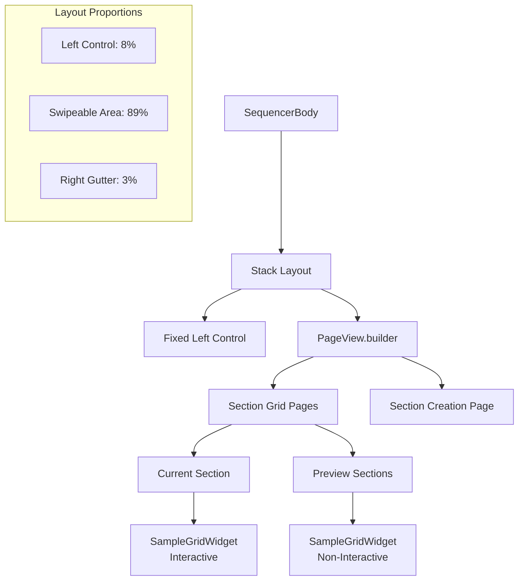

# Section Swipe Implementation

## Overview

The Section Swipe feature introduces horizontal navigation between sequencer sections.

## Core Requirements

### Functional Requirements
- **Horizontal Section Navigation**: Users can swipe left/right to navigate between sections
- **Feed-like Preview**: Adjacent sections are visible during swipe gestures
- **Section Creation**: Swiping past the last section reveals the section creation interface
- **Visual Consistency**: Same SoundGrid widget used for both active and preview sections
- **Preserved Interactions**: Vertical scrolling and drag-and-drop functionality remain intact
- **Version Isolation**: Implementation limited to v2 widgets only

### User Experience Requirements
- **Smooth Transitions**: Natural, responsive swipe gestures
- **Visual Feedback**: Clear distinction between active and preview via interaction state (no opacity dimming)
- **Performance**: No lag during swipe interactions
- **Accessibility**: Intuitive navigation patterns

## Architecture Overview



## Implementation Details

### 1. Layout Structure

#### Main Container: Stack Widget
```dart
Stack(
  children: [
    // Horizontal scrollable content (bottom layer)
    RepaintBoundary(
      child: Container(
        width: double.infinity,
        height: double.infinity,
        child: _buildHorizontalSectionView(context),
      ),
    ),
    
    // Fixed left side control (top layer)
    Positioned(
      left: 0,
      top: 0,
      bottom: 0,
      width: MediaQuery.of(context).size.width * (sideControlWidthPercent / 100.0),
      child: const SoundGridSideControlWidget(side: SideControlSide.left),
    ),
  ],
)
```

**Design Rationale**: 
- `Stack` allows layering fixed elements above scrollable content
- `RepaintBoundary` optimizes rendering performance for the scrollable area
- `Positioned` precisely places the fixed left control panel

#### Layout Proportions
```dart
static const double sideControlWidthPercent = 8.0;   // Fixed left panel
static const double soundGridWidthPercent = 89.0;    // Swipeable content area  
static const double rightGutterWidthPercent = 3.0;   // Visual separator
```

### 2. Horizontal Section Navigation

#### PageView.builder Implementation
```dart
PageView.builder(
  controller: PageController(initialPage: sequencer.currentSectionIndex),
  onPageChanged: (int index) {
    if (index < sequencer.numSections) {
      // Navigate to existing section
      if (index > sequencer.currentSectionIndex) {
        sequencer.switchToNextSection();
      } else if (index < sequencer.currentSectionIndex) {
        sequencer.switchToPreviousSection();
      }
    } else {
      // Swiped to section creation page: toggle side-control state only
      sequencer.openSectionCreationOverlay();
    }
  },
  itemCount: sequencer.numSections + 1, // +1 for section creation
  itemBuilder: (context, index) => _buildPageContent(context, index),
)
```

**Key Features**:
- **Dynamic Page Count**: `numSections + 1` includes section creation as final page
- **State Synchronization**: `onPageChanged` updates the current section in state
- **Bidirectional Navigation**: Supports both forward and backward section switching
- **Section Creation Access**: Final page shows section creation interface

#### Page Content Builder
```dart
Widget _buildPageContent(BuildContext context, int index) {
  return Row(
    children: [
      // Main content area (sound grid or section creation)
      Expanded(
        flex: (soundGridWidthPercent * 100 / (soundGridWidthPercent + rightGutterWidthPercent)).round(),
        child: index < sequencer.numSections
            ? _buildSectionGrid(context, sequencer, index)
            : SectionCreationOverlay(
                onBack: () {
                  sequencer.closeSectionCreationOverlay();
                  _pageController.animateToPage(
                    sequencer.currentSectionIndex,
                    duration: const Duration(milliseconds: 220),
                    curve: Curves.easeOutCubic,
                  );
                },
              ),
      ),
      
      // Right gutter bar
      Expanded(
        flex: (rightGutterWidthPercent * 100 / (soundGridWidthPercent + rightGutterWidthPercent)).round(),
        child: Container(
          decoration: BoxDecoration(
            color: AppColors.sequencerSurfaceBase,
            border: Border(
              right: BorderSide(
                color: AppColors.sequencerBorder.withOpacity(0.3),
                width: 1,
              ),
            ),
          ),
        ),
      ),
    ],
  );
}
```

### 3. Section Grid Rendering

#### Conditional Widget Selection
```dart
Widget _buildSectionGrid(BuildContext context, SequencerState sequencer, int sectionIndex) {
  return Consumer<SequencerState>(
    builder: (context, state, child) {
      if (sectionIndex == state.currentSectionIndex) {
        // Current section: full interactivity
        return const SampleGridWidget();
      } else {
        // Preview section: same widget, reduced interactivity
        return _buildPreviewStackedCards(context, state, sectionIndex);
      }
    },
  );
}
```

#### Preview Section Implementation
```dart
Widget _buildPreviewStackedCards(BuildContext context, SequencerState sequencer, int sectionIndex) {
  if (sectionIndex == sequencer.currentSectionIndex) {
    return const SampleGridWidget();
  } else {
    return IgnorePointer(
      child: SampleGridWidget(sectionIndexOverride: sectionIndex),
    );
  }
}
```

**Design Decisions**:
- **Same Widget Architecture**: Uses identical `SampleGridWidget` for visual consistency
- **IgnorePointer**: Disables all touch interactions for preview sections
- **Full-Opacity Previews**: Previews are no longer dimmed; they render at full opacity
- **Correct Data per Page**: `SampleGridWidget(sectionIndexOverride: sectionIndex)` ensures preview pages show their own section data

### 4. State Management Integration

#### Section Data Access
```dart
// In SequencerState class
List<int?> getSectionGridSamples(int sectionIndex, {int gridIndex = 0}) {
  if (sectionIndex == currentSectionIndex) {
    // Return live data for current section
    return getSoundGridSamples(gridIndex: gridIndex);
  } else {
    // Return stored data for other sections
    try {
      return sectionGridData[sectionIndex][gridIndex] ?? [];
    } catch (e) {
      return List.filled(gridRows * gridColumns, null);
    }
  }
}
```

**Benefits**:
- **Centralized Data Access**: Single method for accessing any section's data
- **Live Current Data**: Current section always shows real-time state
- **Cached Preview Data**: Other sections show stored state for preview
- **Error Handling**: Graceful fallback for missing data

### 5. Performance Optimizations

#### RepaintBoundary Usage
```dart
RepaintBoundary(
  child: Container(
    width: double.infinity,
    height: double.infinity,
    child: _buildHorizontalSectionView(context),
  ),
)
```

#### Consumer Granularity
```dart
// Efficient: Only rebuilds when relevant state changes
Consumer<SequencerState>(
  builder: (context, state, child) {
    // Minimal rebuild scope
  },
)

// vs inefficient full widget rebuilds
```

#### Widget Reuse Strategy
- **Single Widget Type**: Same `SampleGridWidget` for all sections
- **State-based Differentiation**: Behavior controlled via props, not widget type
- **Minimal Widget Tree Changes**: Consistent structure reduces rebuild costs

## Technical Challenges & Solutions

### Challenge 1: Visual Consistency During Swipes

**Problem**: Users expected to see the exact same card stack widget during swipes, not simplified previews.

**Initial Approach**: Custom preview widgets with manual data rendering
```dart
// ❌ Initial approach - custom preview
Widget _buildCustomPreview() {
  return CustomGridPreview(); // Different visual structure
}
```

**Final Solution**: Same widget with interaction control
```dart
// ✅ Final approach - same widget, controlled interaction
Widget _buildPreview() {
  return IgnorePointer(
    child: SampleGridWidget(sectionIndexOverride: sectionIndex), // Exact same widget, full opacity
  );
}
```

### Challenge 2: State Management Complexity

**Problem**: Preview sections needed access to non-current section data without complex state overrides.

**Initial Approach**: Complex state proxy pattern
```dart
// ❌ Overly complex proxy approach
class PreviewSequencerProxy extends ChangeNotifier implements SequencerState {
  // 100+ lines of method overrides and delegation
}
```

**Final Solution**: Simple data access method
```dart
// ✅ Simple data access in SequencerState
List<int?> getSectionGridSamples(int sectionIndex, {int gridIndex = 0}) {
  // Direct data access without complex proxying
}
```

### Challenge 3: Version Isolation

**Problem**: Accidentally importing v1 widgets into v2 implementation.

**Solution**: Strict import management
```dart
// ❌ Wrong import in v2 file
import '../v1/sound_grid_widget.dart' as v1;

// ✅ Correct import in v2 file
import 'sound_grid_widget.dart';
```

## Code Organization

### File Structure
```
app/lib/widgets/sequencer/v2/
├── sequencer_body.dart           # Main implementation
├── sound_grid_widget.dart        # v2 SampleGridWidget
├── section_creation_overlay.dart # Section creation UI
└── ...other v2 widgets
```

### Key Methods in SequencerBody

#### Public Interface
- `build()`: Main widget build method with Stack layout
- Static constants for layout proportions

#### Private Implementation
- `_buildHorizontalSectionView()`: PageView.builder setup
- `_buildPageContent()`: Individual page layout with gutter
- `_buildSectionGrid()`: Section-specific widget selection
- `_buildPreviewStackedCards()`: Preview section wrapper

### Integration Points

#### SequencerState Methods Used
- `currentSectionIndex`: Active section tracking
- `numSections`: Total section count for PageView
- `switchToNextSection()`: Forward navigation
- `switchToPreviousSection()`: Backward navigation
- `openSectionCreationOverlay()`: Section creation trigger
- `getSectionGridSamples()`: Data access for previews

#### Widget Dependencies
- `SampleGridWidget`: Core sound grid implementation
- `SectionCreationOverlay`: Section creation interface
- `SoundGridSideControlWidget`: Fixed left panel
- `AppColors`: Consistent theming

## Testing Considerations

### Manual Testing Scenarios
1. **Basic Navigation**: Swipe between existing sections
2. **Section Creation**: Swipe past last section to create new ones
3. **Preview Visibility**: Verify adjacent sections visible during swipe
4. **Interaction Isolation**: Ensure previews don't respond to touch
5. **State Persistence**: Verify section state maintained across navigation
6. **Performance**: Test smooth swipes with multiple sections

### Edge Cases
- **Single Section**: Behavior with only one section
- **No Sections**: Automatic section creation overlay
- **Rapid Swipes**: Multiple quick swipe gestures
- **State Changes**: Section data updates during swipe
- **Single Overlay Policy**: Section settings cannot open on top of creation screen

## Future Enhancements

### Potential Improvements
1. **Custom Transitions**: Enhanced animation between sections
2. **Section Thumbnails**: Mini previews in section indicators
3. **Gesture Refinements**: Velocity-based snapping behavior
4. **Accessibility**: Screen reader support for section navigation
5. **Keyboard Navigation**: Arrow key support for section switching

### Performance Optimizations
1. **Lazy Loading**: Load section data only when needed
2. **Virtual Scrolling**: For large numbers of sections
3. **Animation Optimization**: GPU-accelerated transitions
4. **Memory Management**: Dispose unused section widgets

## Related Documentation

- [Position-Retained Scrolling](./position_retained_scrolling.md) - Vertical scroll behavior within sections
- [Sequencer V2 Layout](../user_flow/sequncer/v2/sequencer.md) - Overall V2 interface design
- [Stacked Cards Widget](../../widgets/stacked_cards_widget.dart) - Card stack implementation

## Migration Guide

### From V1 to V2 Section Navigation

#### V1 Pattern (Arrow Buttons)
```dart
// V1: Button-based section navigation
Row(
  children: [
    IconButton(onPressed: previousSection),
    SoundGrid(),
    IconButton(onPressed: nextSection),
  ],
)
```

#### V2 Pattern (Swipe Navigation)
```dart
// V2: Swipe-based section navigation
PageView.builder(
  onPageChanged: handleSectionChange,
  itemBuilder: (context, index) => SectionContent(index),
)
```

This implementation provides a modern, intuitive section navigation experience while maintaining the core functionality and visual consistency of the sequencer interface. 