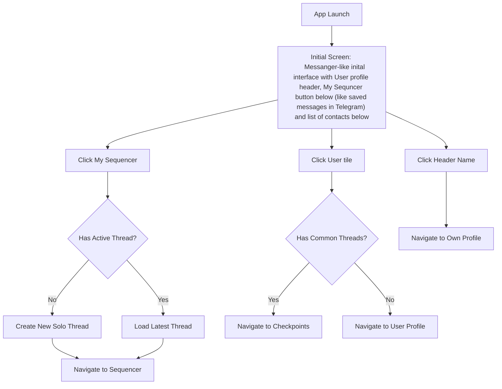

# Inital Screen Flow

```mermaid
graph TD
    A[App Launch] --> B["Initial Screen: 
    Messanger-like inital interface with User profile header, My Sequncer button below (like saved messages in Telegram) and list of contacts below"]
    
    B --> C[Click My Sequencer]
    B --> D[Click User tile]
    B --> E[Click Header Name]
    
    C --> F{Has Active Thread?}
    F -->|No| G[Create New Solo Thread]
    F -->|Yes| H[Load Latest Thread]
    G --> I[Navigate to Sequencer]
    H --> I
    
    D --> J{Has Common Threads?}
    J -->|Yes| K[Navigate to Checkpoints]
    J -->|No| L[Navigate to User Profile]
    
    E --> M[Navigate to Own Profile]
``` 