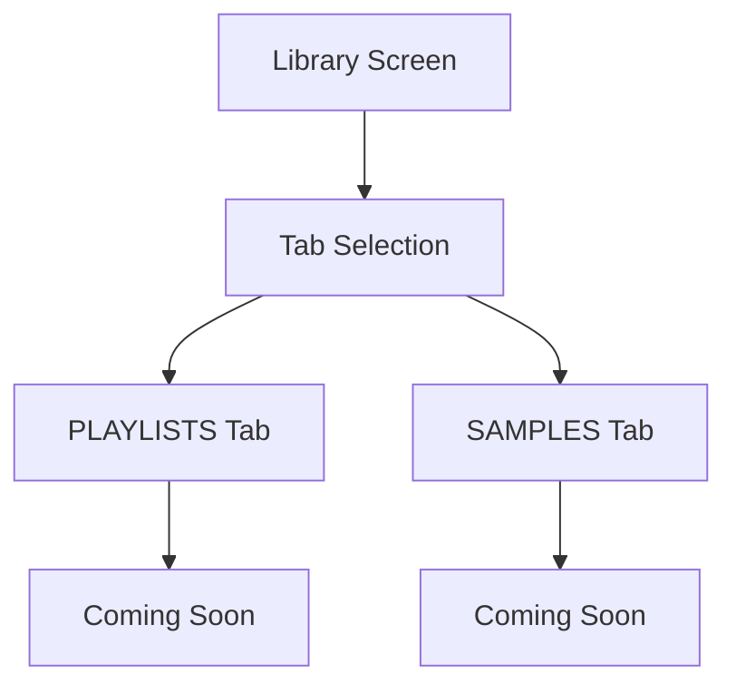

# Library Screen

## Layout
- **Header**: Current user name, logout button, online indicator
- **Tab Bar**: "PLAYLISTS" and "SAMPLES"
- **Content**: Tab-based content area

## Tab Actions
- **PLAYLISTS**: Shows "Coming soon" placeholder
- **SAMPLES**: Shows "Coming soon" placeholder

## Flow

## Key Features
- Clean tab-based navigation
- Consistent header with other screens
- Placeholder content for future features 