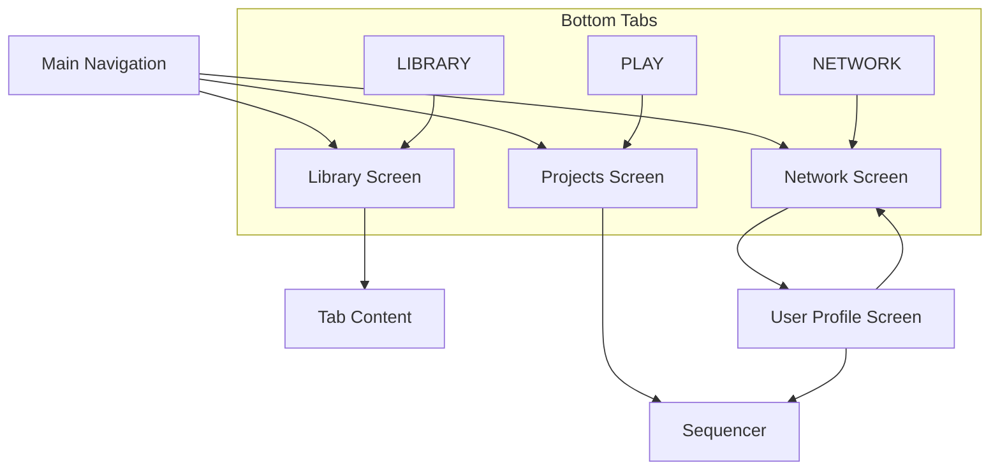

# Menu Navigation Overview

## Screen Structure
All screens share common elements:
- **Header**: Current user name, logout button, online indicator
- **Footer**: Bottom navigation tabs (PLAY, LIBRARY, NETWORK)

## Navigation Flow

## Key Interactions
- **Projects → Sequencer**: Load project data into sequencer (CONTINUE/NEW/Project tiles)
- **Network → User Profile**: User collaboration
- **User Profile → Sequencer**: Load collaborator's project into sequencer (Source button)
- **Bottom Tabs**: Primary navigation between screens

## Project Loading
All project-related buttons load project data into sequencer before navigation:
- Show "Loading project..." indicator
- Load project data using `sequencerState.loadFromThread()`
- Navigate to sequencer with data ready

## Design Principles
- **Consistent headers** across all screens
- **Direct sequencer access** from multiple points
- **Clean loading states** with proper feedback
- **Black-white theme** throughout menu screens 