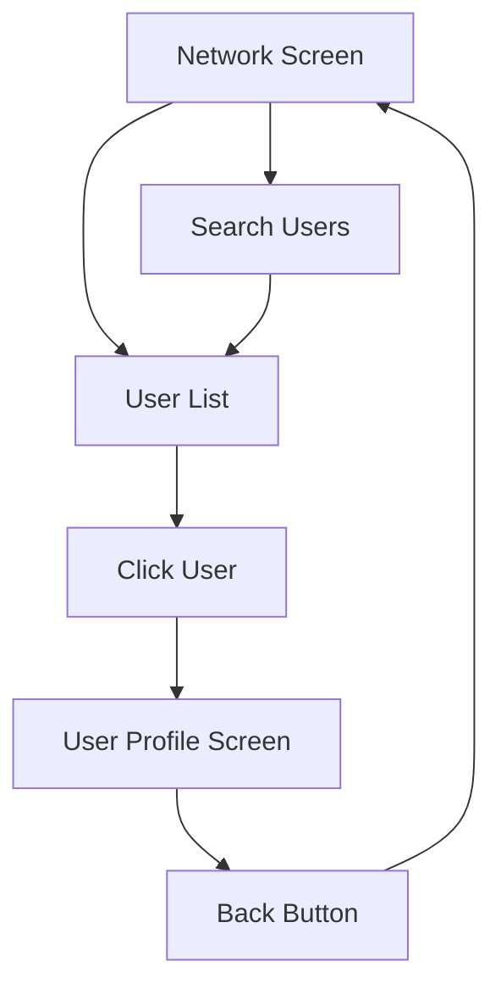

# Network Screen

## Layout
- **Header**: Current user name, logout button, online indicator
- **Search Bar**: User search functionality
- **User List**: List of users with online status indicators

## User Actions
- **Search**: Filter users by name
- **User Tile**: Click → Opens User Profile Screen
- **Online Indicators**: 
  - Green dot: User online
  - Gray dot: User offline

## Flow

## Key Features
- Real-time online status
- Search functionality
- Navigation to user profiles
- Consistent header design 