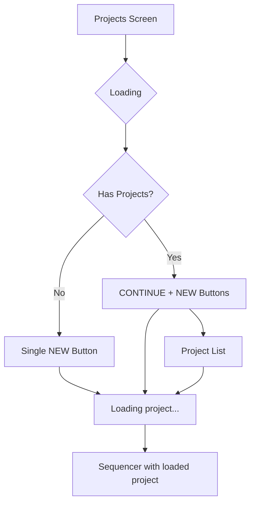

# Projects Screen

## Layout
- **Header**: Current user name, logout button, online indicator
- **Loading**: Shows loading indicator only
- **Buttons**: 
  - No projects: Single "NEW" button (full width)
  - Has projects: "CONTINUE" (70%) + "NEW" (30%)
- **Project List**: "RECENT" header with project cards

## Button Actions
- **CONTINUE**: Loads latest project into sequencer → Opens sequencer
- **NEW**: Creates new empty project → Opens sequencer  
- **Project Card**: Loads selected project into sequencer → Opens sequencer

## Loading Behavior
All buttons show "Loading project..." indicator before navigating to sequencer with the project data loaded.

## Flow

## Key Features
- Automatic layout decision based on project availability
- Direct sequencer navigation
- Recent projects prioritized 