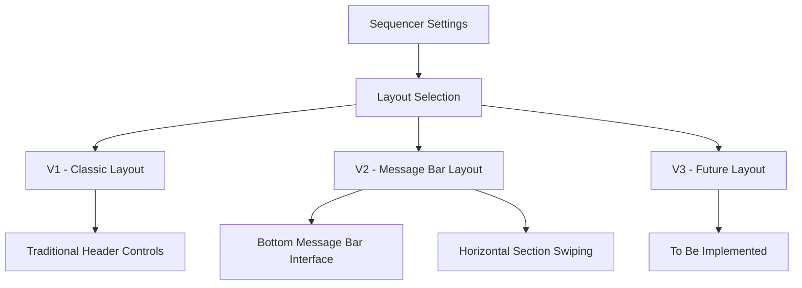
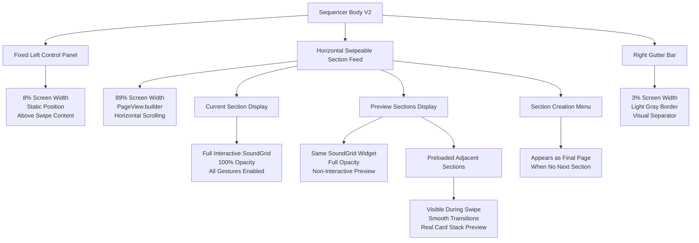
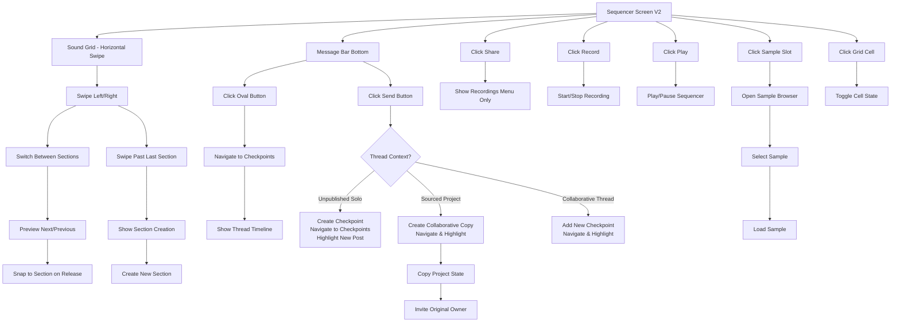

# Sequencer V2 Layout

## Overview

The V2 layout introduces a messenger-style interface with a bottom message bar, replacing traditional header-based navigation. This layout focuses on collaborative workflow with streamlined checkpoint management and **horizontal section navigation** via swipe gestures.

## Layout Selection



## Sequencer Header (V2 Simplified)

```mermaid
graph TD
    %% Header Section (Simplified in V2)
    A[Sequencer Header V2]
    A --> B[📊 Share]
    A --> C[🔴 Record]
    A --> D[▶️ Play/Stop Button]
    
    %% Note: Save/Send and Checkpoints buttons removed in V2
    
    %% Share Button Logic (Same as V1)
    B --> E[Show Share Menu]
    E --> F{Thread Type?}
    F -->|Unpublished Solo| G[Show Publish Button + Recordings]
    F -->|Other| H[Show Recordings Only]
```



## Section Navigation (New in V2)



## Bottom Message Bar (New in V2)

```mermaid
graph TD
    %% Message Bar Components
    A[Message Bar] --> B[Oval Navigation Button]
    A --> C[Send Button]
    
    %% Navigation Button Logic
    B --> D[Navigate to Checkpoints]
    D --> E[Show Thread Timeline]
    
    %% Send Button Logic
    C --> F{Thread Context Check}
    F -->|Unpublished Solo| G[💾 Save: Create Checkpoint<br/>Navigate to Checkpoints<br/>Highlight New Post]
    F -->|Sourced Project| H[📤 Send: Add to Source Thread<br/>Join Collaboration<br/>Navigate & Highlight]
    F -->|Collaborative| I[📤 Send: Add New Checkpoint<br/>To Existing Thread<br/>Navigate & Highlight]
    
    %% Highlight Animation
    G --> J[2sec Color Transition<br/>Original → Light Blue → Original]
    H --> J
    I --> J
```



## Main Sequencer Window (V2)



## Key Differences from V1

### Removed Elements
- ❌ **Save/Send Button** from header
- ❌ **Checkpoints Button** from header
- ❌ **Popup notifications** on save
- ❌ **Right-side section control panel**
- ❌ **Arrow buttons for section navigation**

### New Elements
- ✅ **Message Bar** at bottom
- ✅ **Oval Navigation Button** for checkpoints access
- ✅ **Send Button** with save logic
- ✅ **Color highlight animation** for new posts
- ✅ **Horizontal section swiping** interface
- ✅ **Feed-like section preview** during swipes
- ✅ **Right gutter bar** (3% width visual separator)

### Enhanced Features
- 🎨 **Silent Save Operation** - no intrusive popups
- 🎨 **Smooth Color Animation** - 1 second highlight transition
- 🎨 **Messenger-style Interface** - familiar chat-like experience
- 🎨 **Streamlined Navigation** - direct access to checkpoints timeline
- 🎨 **Intuitive Section Navigation** - natural swipe gestures
- 🎨 **Real-time Section Preview** - see adjacent sections during swipe

## Section Swiping Interface

### Layout Structure
```
┌─────────────────────────────────────────────────────────┐
│ [8%] │         [89%]          │ [3%] │               │
│ Left │    Swipeable Sections   │Gutter│    Header     │
│Fixed │   ┌─────────────────┐   │ Bar  │               │
│Panel │   │   Section N-1   │   │      │               │
│      │   │   (Preview)     │   │      │               │
│      │   │                 │   │      │               │
│      │   └─────────────────┘   │      │               │
│      │   ┌─────────────────┐   │      │               │
│      │   │   Section N     │   │      │               │
│      │   │   (Active)      │   │      │               │
│      │   │                 │   │      │               │
│      │   └─────────────────┘   │      │               │
│      │   ┌─────────────────┐   │      │               │
│      │   │   Section N+1   │   │      │               │
│      │   │   (Preview)     │   │      │               │
│      │   │                 │   │      │               │
│      │   └─────────────────┘   │      │               │
└─────────────────────────────────────────────────────────┘
│                Message Bar                             │
└─────────────────────────────────────────────────────────┘
```

### Swipe Behavior
- **Horizontal PageView**: Smooth section-to-section navigation
- **Preview Visibility**: Adjacent sections visible during swipe gesture
- **Snap Behavior**: Automatic snap to nearest section on release
- **Section Creation**: Appears as final page when swiping past last section
- **Visual Consistency**: Same SoundGrid widget for all sections (active vs preview). Previews are full opacity but non-interactive.

## Overlay Menus

- Overlays (sample browser and section settings) are layered only over the grid area, keeping the left side control panel visible.
- Only one overlay can be open at a time. When the section creation page is active, section settings cannot be opened.
- Section settings header text is centered and slightly translucent (darker gray) so the grid is faintly visible behind.
- Section settings does not show a close button; toggle via the side control button.
- Loop/song mode indicator and redundant "Section N" label above loop count are removed.
- Section creation page header title is centered; back navigation uses a larger, simplified arrow and animates back to the current section.

## Animation Details

### New Post Highlight
When a checkpoint is saved via the message bar send button:

1. **Automatic Navigation** to checkpoints screen
2. **Color Animation** on newest checkpoint:
   - Duration: 1 second total
   - Transition: Original Color → Light Blue → Original Color
   - Curve: Smooth ease-in-out
   - Target: Only the newest checkpoint message

### Section Transition Animation
When swiping between sections:

1. **Smooth Horizontal Translation** via PageView
2. **Preview State** remains full opacity; interaction is disabled for previews
3. **Interactive State Change** from non-interactive to full interactivity on snap
4. **Preserved Scroll Position** within each section's grid

## User Experience Flow

### Typical V2 Workflow
```
1. User opens Sequencer (V2 layout selected)
2. Works on beat using familiar sequencer controls
3. Swipes left/right to navigate between sections
4. Previews adjacent sections during swipe gesture
5. Creates new sections by swiping past the last one
6. Clicks oval button → Views checkpoints/collaboration
7. Returns to sequencer, continues working
8. Clicks send button → Saves + navigates to checkpoints
9. Newest post highlights with smooth color animation
10. User sees their contribution in the thread timeline
```

### Section Management Workflow (V2)
```
1. User creates first section automatically
2. Swipes right to see section creation interface
3. Creates additional sections as needed
4. Swipes between sections to work on different parts
5. Each section maintains independent state
6. Preview shows actual content during navigation
7. Seamless workflow between composition sections
```

### Collaborative Session (V2)
```
1. User A creates project, works in V2 layout
2. Creates multiple sections via swiping interface
3. Sends checkpoint via message bar
4. User B joins thread, also uses V2 layout
5. User B navigates sections via swipe, adds improvements
6. User B sends improvements via message bar
7. Both see real-time collaboration history
8. Each new checkpoint highlights smoothly
9. Seamless back-and-forth collaboration across sections
```

## Technical Implementation

### Layout Selection State
- **SequencerState.selectedLayout**: Enum value (v1, v2, v3)
- **Settings Screen**: Radio buttons for layout selection
- **Conditional Rendering**: Different widget trees based on selection

### Section Swiping Components
- **PageView.builder**: Horizontal scrolling container for sections
- **Stack Widget**: Layers fixed left control above swipeable content
- **Positioned Widget**: Precise placement of fixed elements
- **Consumer/Selector**: Efficient state management and rebuilds
- **IgnorePointer**: Disables interaction for preview sections

### Message Bar Components
- **MessageBarWidget**: Main container for V2 bottom interface
- **Oval Button**: Rounded rectangle with navigation logic
- **Send Button**: Icon button with checkpoint save logic
- **Material Design**: Consistent with app theme

### Animation System
- **AnimationController**: 1-second duration for color transition
- **ColorTween**: From original to light blue and back
- **Conditional Application**: Only newest checkpoint when `highlightNewest: true`
- **Performance**: Efficient with single animation cycle

### Section Preview System
- **Same Widget Architecture**: Uses identical SoundGrid widget for consistency
- **Full-Opacity Previews**: Active and preview sections share the same visual opacity; previews are non-interactive
- **State Isolation**: Each section maintains independent grid state
- **Performance Optimization**: RepaintBoundary for efficient rendering

This V2 layout provides a modern, messenger-inspired interface with intuitive section navigation that enhances collaborative music creation while maintaining the core sequencer functionality. 