# Sequencer V2 Layout

## Overview

The V2 layout introduces a messenger-style interface with a bottom message bar, replacing traditional header-based navigation. This layout focuses on collaborative workflow with streamlined checkpoint management.

## Layout Selection


## Sequencer Header (V2 Simplified)

```mermaid
graph TD
    %% Header Section (Simplified in V2)
    A[Sequencer Header V2]
    A --> B[📊 Share]
    A --> C[🔴 Record]
    A --> D[▶️ Play/Stop Button]
    
    %% Note: Save/Send and Checkpoints buttons removed in V2
    
    %% Share Button Logic (Same as V1)
    B --> E[Show Share Menu]
    E --> F{Thread Type?}
    F -->|Unpublished Solo| G[Show Publish Button + Recordings]
    F -->|Other| H[Show Recordings Only]
```



## Bottom Message Bar (New in V2)

```mermaid
graph TD
    %% Message Bar Components
    A[Message Bar] --> B[Oval Navigation Button]
    A --> C[Send Button]
    
    %% Navigation Button Logic
    B --> D[Navigate to Checkpoints]
    D --> E[Show Thread Timeline]
    
    %% Send Button Logic
    C --> F{Thread Context Check}
    F -->|Unpublished Solo| G[💾 Save: Create Checkpoint<br/>Navigate to Checkpoints<br/>Highlight New Post]
    F -->|Sourced Project| H[📤 Send: Add to Source Thread<br/>Join Collaboration<br/>Navigate & Highlight]
    F -->|Collaborative| I[📤 Send: Add New Checkpoint<br/>To Existing Thread<br/>Navigate & Highlight]
    
    %% Highlight Animation
    G --> J[2sec Color Transition<br/>Original → Light Blue → Original]
    H --> J
    I --> J
```



## Main Sequencer Window (V2)


## Key Differences from V1

### Removed Elements
- ❌ **Save/Send Button** from header
- ❌ **Checkpoints Button** from header
- ❌ **Popup notifications** on save

### New Elements
- ✅ **Message Bar** at bottom
- ✅ **Oval Navigation Button** for checkpoints access
- ✅ **Send Button** with save logic
- ✅ **Color highlight animation** for new posts
- ✅ **Smaller Sound Grid** to accommodate message bar

### Enhanced Features
- 🎨 **Silent Save Operation** - no intrusive popups
- 🎨 **Smooth Color Animation** - 1 second highlight transition
- 🎨 **Messenger-style Interface** - familiar chat-like experience
- 🎨 **Streamlined Navigation** - direct access to checkpoints timeline

## Animation Details

### New Post Highlight
When a checkpoint is saved via the message bar send button:

1. **Automatic Navigation** to checkpoints screen
2. **Color Animation** on newest checkpoint:
   - Duration: 1 second total
   - Transition: Original Color → Light Blue → Original Color
   - Curve: Smooth ease-in-out
   - Target: Only the newest checkpoint message

## User Experience Flow

### Typical V2 Workflow
```
1. User opens Sequencer (V2 layout selected)
2. Works on beat using familiar sequencer controls
3. Clicks oval button → Views checkpoints/collaboration
4. Returns to sequencer, continues working
5. Clicks send button → Saves + navigates to checkpoints
6. Newest post highlights with smooth color animation
7. User sees their contribution in the thread timeline
```

### Collaborative Session (V2)
```
1. User A creates project, works in V2 layout
2. Sends checkpoint via message bar
3. User B joins thread, also uses V2 layout
4. User B adds improvements, sends via message bar
5. Both see real-time collaboration history
6. Each new checkpoint highlights smoothly
7. Seamless back-and-forth collaboration
```

## Technical Implementation

### Layout Selection State
- **SequencerState.selectedLayout**: Enum value (v1, v2, v3)
- **Settings Screen**: Radio buttons for layout selection
- **Conditional Rendering**: Different widget trees based on selection

### Message Bar Components
- **MessageBarWidget**: Main container for V2 bottom interface
- **Oval Button**: Rounded rectangle with navigation logic
- **Send Button**: Icon button with checkpoint save logic
- **Material Design**: Consistent with app theme

### Animation System
- **AnimationController**: 1-second duration for color transition
- **ColorTween**: From original to light blue and back
- **Conditional Application**: Only newest checkpoint when `highlightNewest: true`
- **Performance**: Efficient with single animation cycle

This V2 layout provides a modern, messenger-inspired interface that enhances collaborative music creation while maintaining the core sequencer functionality. 