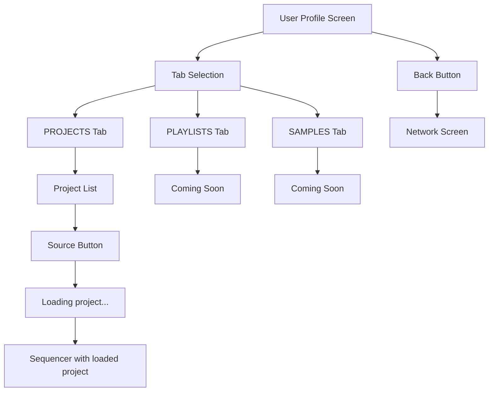

# User Profile Screen

## Layout
- **App Bar**: Back button, username, online indicator (right)
- **Tab Bar**: "PROJECTS", "PLAYLISTS", "SAMPLES"
- **Content**: Tab-based content area

## Tab Content
- **PROJECTS**: User's project list with:
  - Date header
  - Project name
  - "Source" button (right)
  - "Renders: 0" footer
- **PLAYLISTS**: "Coming soon" placeholder
- **SAMPLES**: "Coming soon" placeholder

## Button Actions
- **Back**: Returns to Network Screen
- **Source**: Loads selected project into sequencer → Opens sequencer

## Loading Behavior
Source button shows "Loading project..." indicator before navigating to sequencer with the project data loaded.

## Flow

## Key Features
- Separate screen navigation
- Online status in header
- Project collaboration via Source button
- Placeholder tabs for future features 