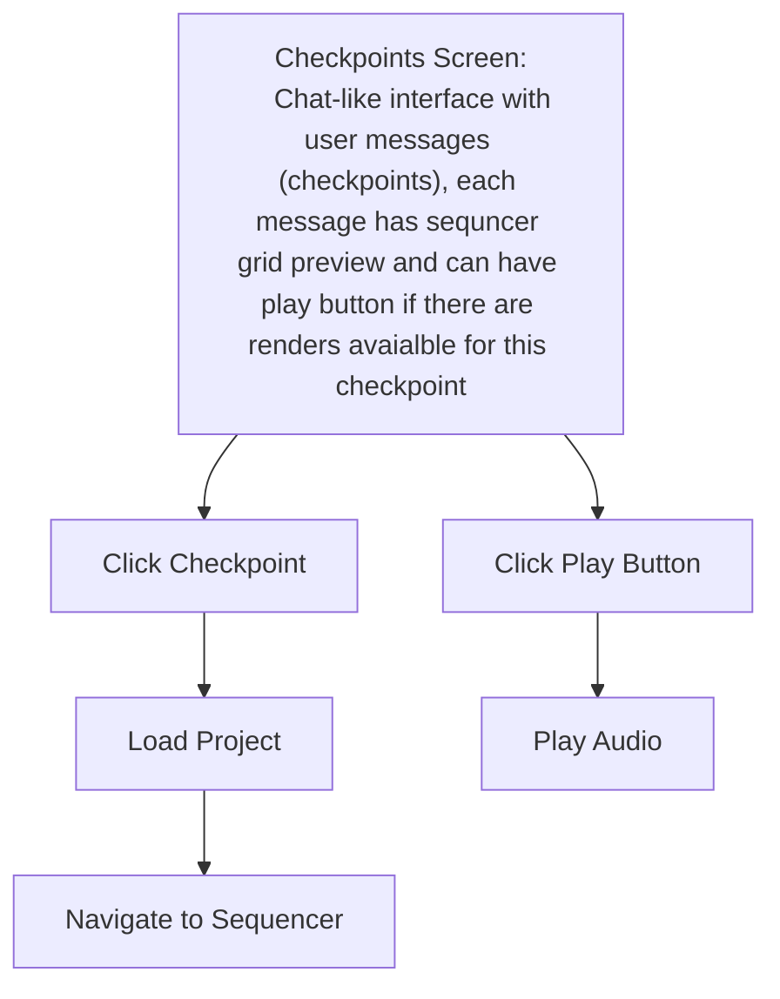

# Checkpoints Screen

```mermaid
graph TD
    B["Checkpoints Screen:
    Chat-like interface with user messages (checkpoints), each message has sequncer grid preview and can have play button if there are renders avaialble for this checkpoint"]
    B --> C["Click Checkpoint"]
    B --> D["Click Play Button"]
        
    C --> H["Load Project"]
    H --> I["Navigate to Sequencer"]
    
    D --> K["Play Audio"]

``` 