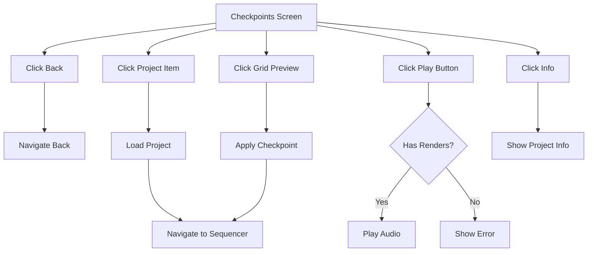

# Checkpoints Screen Flow

```mermaid
graph TD
    A[Checkpoints Screen] --> B[Click Back]
    A --> C[Click Project Item]
    A --> D[Click Play Button]
    A --> E[Click Grid Preview]
    A --> F[Click Info]
    
    B --> G[Navigate Back]
    
    C --> H[Load Project]
    H --> I[Navigate to Sequencer]
    
    D --> J{Has Renders?}
    J -->|Yes| K[Play Audio]
    J -->|No| L[Show Error]
    
    E --> M[Apply Checkpoint]
    M --> I
    
    F --> N[Show Project Info]
``` 