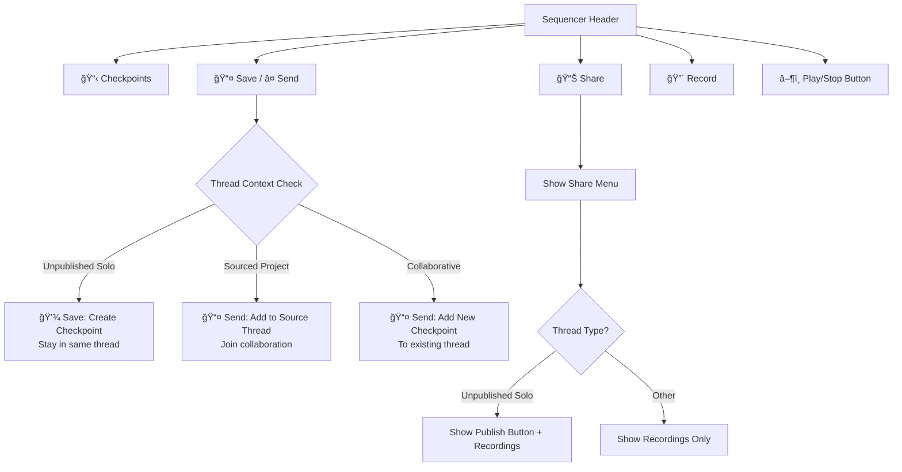
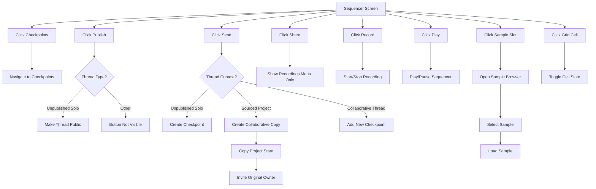

# Sequencer Header

```mermaid
graph TD
    %% Header Section
    A[Sequencer Header]
    A --> B[📋 Checkpoints]
    A --> C[📤 Save / ⤠Send]
    A --> D[📊 Share]
    A --> E[🔴 Record]
    A --> F[â–¶ï¸ Play/Stop Button]

    %% Save/Send Button Logic
    C --> G{Thread Context Check}
    G -->|Unpublished Solo| H[💾 Save: Create Checkpoint<br/>Stay in same thread]
    G -->|Sourced Project| I[📤 Send: Add to Source Thread<br/>Join collaboration]
    G -->|Collaborative| J[📤 Send: Add New Checkpoint<br/>To existing thread]

    %% Share Button Logic
    D --> K[Show Share Menu]
    K --> L{Thread Type?}
    L -->|Unpublished Solo| M[Show Publish Button + Recordings]
    L -->|Other| N[Show Recordings Only]
```

# Main Sequencer Window

```mermaid
graph TD
    A[Sequencer Screen] --> B[Click Checkpoints]
    A --> C[Click Publish]
    A --> D[Click Send]
    A --> E[Click Share]
    A --> F[Click Record]
    A --> G[Click Play]
    A --> H[Click Sample Slot]
    A --> I[Click Grid Cell]
    
    B --> J[Navigate to Checkpoints]
    
    C --> K{Thread Type?}
    K -->|Unpublished Solo| L[Make Thread Public]
    K -->|Other| M[Button Not Visible]
    
    D --> N{Thread Context?}
    N -->|Unpublished Solo| O[Create Checkpoint]
    N -->|Sourced Project| P[Create Collaborative Copy]
    N -->|Collaborative Thread| Q[Add New Checkpoint]
    
    E --> R[Show Recordings Menu Only]
    
    F --> S[Start/Stop Recording]
    G --> T[Play/Pause Sequencer]
    
    H --> U[Open Sample Browser]
    U --> V[Select Sample]
    V --> W[Load Sample]
    
    I --> X[Toggle Cell State]
    
    P --> Y[Copy Project State]
    Y --> Z[Invite Original Owner]
``` 