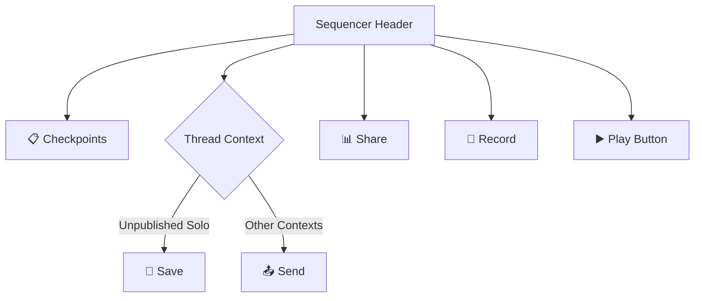
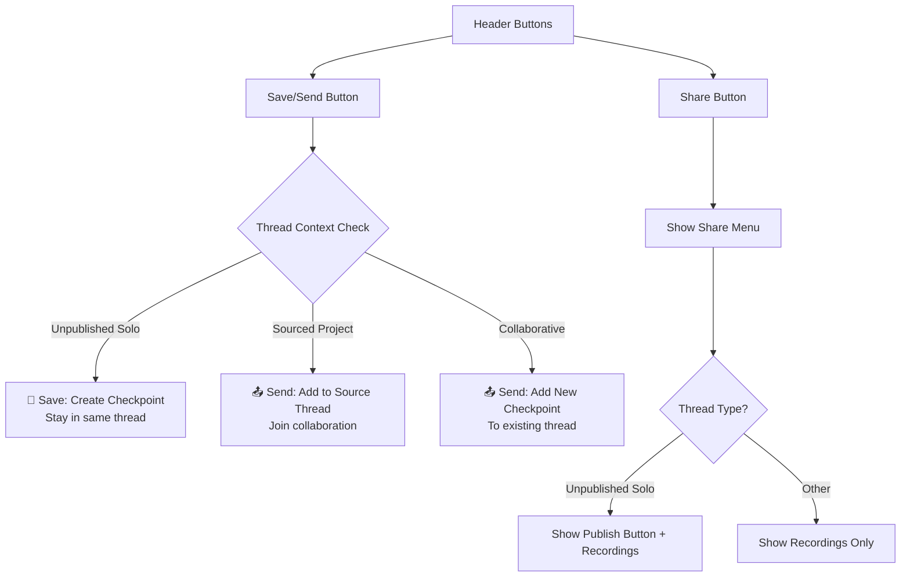
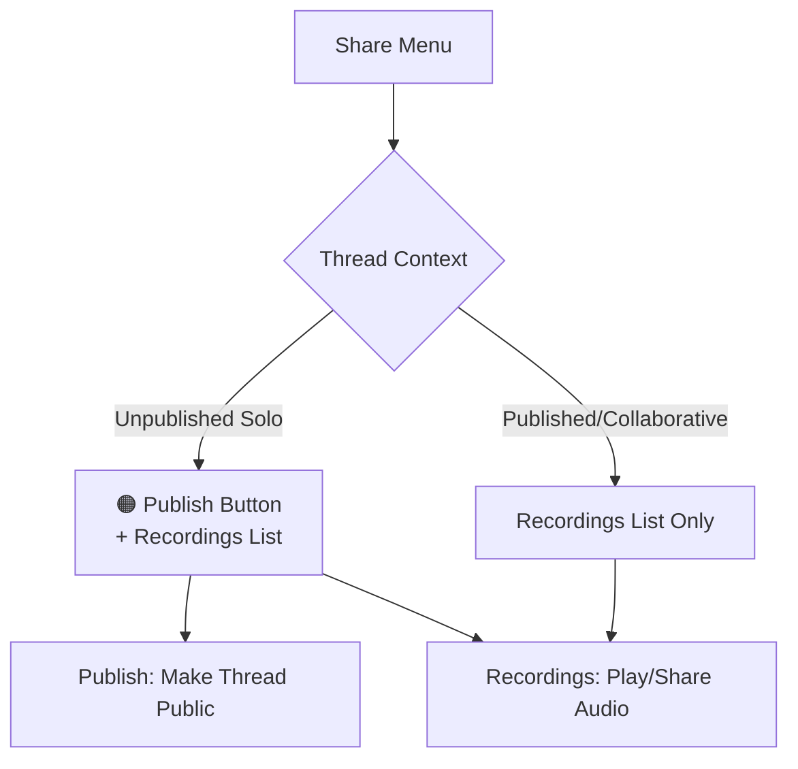

# Sequencer Header Layout

## New Button Structure

```mermaid
graph TD
    A[Sequencer Header] --> B[📋 Checkpoints]
    A --> H{Thread Context}
    H -->|Unpublished Solo| J[💾 Save]
    H -->|Other Contexts| K[📤 Send]

    A --> F[📊 Share]
    A --> D[🔴 Record]
    A --> E[▶️ Play Button]
```

## Button Behaviors

```mermaid
graph TD
    A[Header Buttons] --> B[Save/Send Button]
    A --> C[Share Button]
    
    B --> D{Thread Context Check}
    D -->|Unpublished Solo| E[💾 Save: Create Checkpoint<br/>Stay in same thread]
    D -->|Sourced Project| F[📤 Send: Add to Source Thread<br/>Join collaboration]
    D -->|Collaborative| G[📤 Send: Add New Checkpoint<br/>To existing thread]
    
    C --> H[Show Share Menu]
    H --> I{Thread Type?}
    I -->|Unpublished Solo| J[Show Publish Button + Recordings]
    I -->|Other| K[Show Recordings Only]
```

## Share Menu Content

```mermaid
graph TD
    A[Share Menu] --> B{Thread Context}
    B -->|Unpublished Solo| C[🟠 Publish Button<br/>+ Recordings List]
    B -->|Published/Collaborative| D[Recordings List Only]
    
    C --> E[Publish: Make Thread Public]
    C --> F[Recordings: Play/Share Audio]
    
    D --> F
```