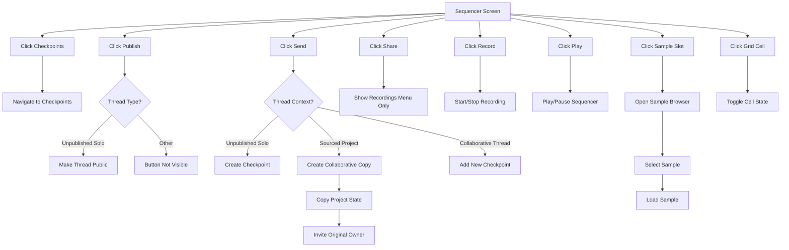

# Sequencer Screen Flow

```mermaid
graph TD
    A[Sequencer Screen] --> B[Click Checkpoints]
    A --> C[Click Publish]
    A --> D[Click Send]
    A --> E[Click Share]
    A --> F[Click Record]
    A --> G[Click Play]
    A --> H[Click Sample Slot]
    A --> I[Click Grid Cell]
    
    B --> J[Navigate to Checkpoints]
    
    C --> K{Thread Type?}
    K -->|Unpublished Solo| L[Make Thread Public]
    K -->|Other| M[Button Not Visible]
    
    D --> N{Thread Context?}
    N -->|Unpublished Solo| O[Create Checkpoint]
    N -->|Sourced Project| P[Create Collaborative Copy]
    N -->|Collaborative Thread| Q[Add New Checkpoint]
    
    E --> R[Show Recordings Menu Only]
    
    F --> S[Start/Stop Recording]
    G --> T[Play/Pause Sequencer]
    
    H --> U[Open Sample Browser]
    U --> V[Select Sample]
    V --> W[Load Sample]
    
    I --> X[Toggle Cell State]
    
    P --> Y[Copy Project State]
    Y --> Z[Invite Original Owner]
``` 