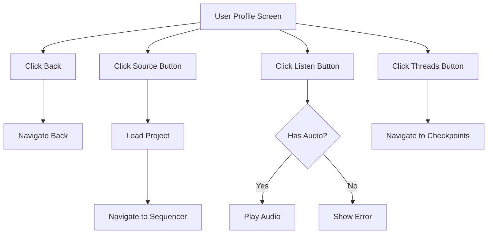

# User Profile Screen 

```mermaid
graph TD
    A[User Profile Screen] --> B[Click Back]
    A --> C[Click Source Button]
    A --> D[Click Listen Button]
    A --> E[Click Threads Button]
    
    B --> F[Navigate Back]
    
    C --> G[Load Project]
    G --> H[Navigate to Sequencer]
    
    D --> I{Has Audio?}
    I -->|Yes| J[Play Audio]
    I -->|No| K[Show Error]
    
    E --> L[Navigate to Checkpoints]
``` 